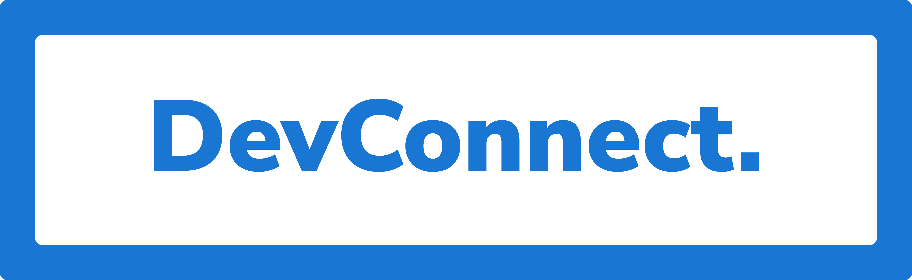

  

<h1 align="center">DevConnect.</h1>

# Introducing DevConnect

[DevConnect](https://dev-connect.vercel.app/) is an app for developers to know about each other and their inspiring works. It comes with developer profiles that consists of his/her little personal details and lot of professional details like current designation, tech skills, projects, blogs, social media handles.

> [Live Demo](https://dev-connect.vercel.app/) /
> [Read Blog]()

# Build With 💻

- [React JS](https://reactjs.org/) - for Fronted
- [Tailwind CSS](https://tailwindcss.com/) - for styling
- [Firebase](https://firebase.google.com/) - for database
- [Auth0](https://auth0.com/) - for user authentication
- [react-hot-toast](https://react-hot-toast.com/) - for toasts
- [react-router-dom](https://reactrouter.com/web/guides/quick-start) - for routing
- [Vercel](https://auth0.com/) - for deploying

# Future Improvements🔮

- Following profiles
- Profile with Workplace and Experience
- Improved UI and UX
- Share your profile URL publicly
- Like and Comment Profile

# Connect with me 🌐
 
- [Twitter](https://twitter.com/Nimalan_) 
- [Github](https://github.com/nimalansivakumar) 
- [LinkedIn](https://www.linkedin.com/in/nimalan-sivakumar-743507203/)
